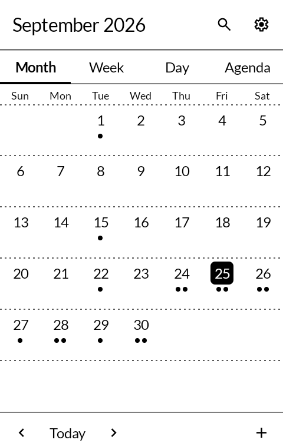
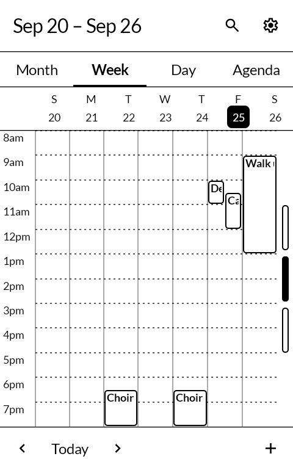
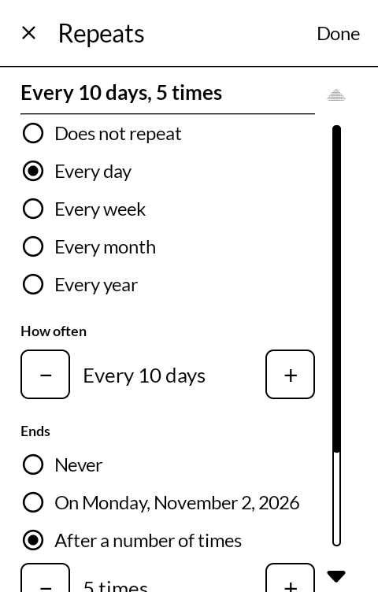
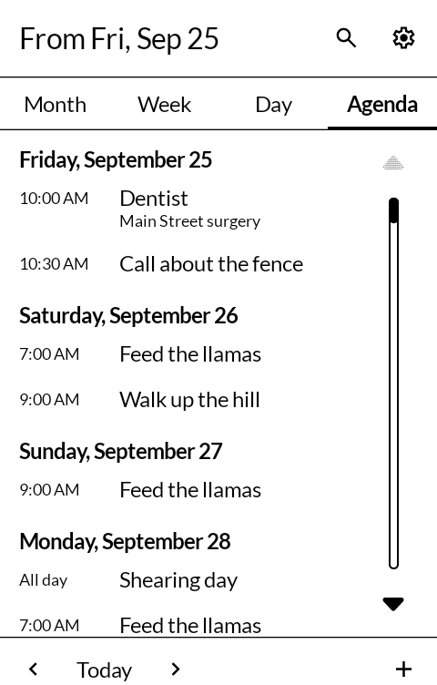

# 暦 koyomi — Calendar

A calendar for an E Ink phone: month, week, day and agenda, repeating events of any
ordinary shape, and reminders that light the screen.

*Koyomi* is the everyday Japanese word for a calendar, and the older one for an almanac —
the printed year that told you the days, the moons and when to plant.

Built for the [Mudita Kompakt](https://mudita.com/products/kompakt/), whose 4.3" panel has
sixteen greys, a slow redraw, and is read outdoors as often as indoors.

| | |
|---|---|
|  |  |
|  |  |

## Where the calendars come from

It shows and changes the calendars already on the phone — the same store every calendar app
on Android reads. It has no account and no sync of its own and never reaches the network.

To have a Nextcloud, Fastmail, iCloud or any other CalDAV calendar here, set it up in
[DAVx5](https://www.davx5.com/) first. DAVx5 keeps the phone's store and the server in step;
an event made or changed here reaches the server because DAVx5 carries it there.

**Google Calendar goes through DAVx5 too**, and its sign-in opens in the phone's default
browser. The Kompakt's built-in one is refused by Google ("Error 403: disallowed_useragent").
Readers of the KompaktCalendar thread on the Mudita forum found the way past it: install
[EinkBro](https://github.com/plateaukao/einkbro), make it the default browser, then add the
Google account in DAVx5.

A calendar called **PC Sync** may appear under Settings → Calendars. The phone's own calendar
store makes it; it belongs to no account, so nothing saved in it leaves the phone.

## What it does

**Four views.** A month of days with a mark for each event; a week and a day as a timeline,
twelve hours at a time, changed by a swipe up or down; and an agenda of the six months ahead.
A swipe across turns one page and stops. Nothing scrolls on its own and nothing animates.

**Repeats of every ordinary shape.** Every so many days, weeks, months or years; chosen days
of the week; the 25th of the month or the fourth Friday or the last one; for ever, until a
date, or a number of times. "Every 10 days, 5 times" is one screen. The rule is written and
read by Etar's own parser, so what comes from the server is read the way Etar reads it.

A rule this app cannot show — two days of the month, a rule set on the server with parts it
has no control for — is said so and left exactly as it is. Nothing here rewrites a rule it
did not make.

**Change or delete one occurrence**, every later one, or all of them.

**Reminders from the phone's own store**, so the ones set on the server ring here too, and
each one rings once. With the screen asleep a reminder wakes it with the event on it; there
is a setting for a notification alone.

**Today's events on the lock screen**, with
[Glance](https://github.com/wanderwildwood/hitome) installed: what is left of today, all-day
events first. Settings has the switch.

**It asks before deleting**, on the row itself: the first press arms it, the second does it,
and it forgets after four seconds.

**Other apps' "add to calendar" opens here.** The new-event screen comes up filled in with
what the other app sent — title, time or all day, place, notes, and a repeat — and nothing
is saved until you press Save. "Show this event" from another app opens the event. An event
that came from an app able to show what it was made from - a ticket added from
[Wallet](https://github.com/wanderwildwood/satsuire) - has an "Open in Wallet" button
under its title, while that app is on the phone.

**Calendar files open here.** An .ics file, from a mail attachment, a download or a file
manager, lists the events in it with their dates, times and places; choose the calendar and
press Add. Times keep their own time zone and are shown in the phone's; repeats come across
as they are written. An invitation is added as a plain event and no reply is sent. Opening
the same file twice adds its events once.

**Define in an event's notes.** The notes can be selected, and the menu over them offers
Copy, and Define from [Dictionary](https://github.com/wanderwildwood/jibiki) where it is
installed, behind the ⋮.

## What it does not do

It does not sync; DAVx5 does. It has no guests, invitations or colours, and no widget. It
does not answer invitations, and it does not keep the reminders written into a calendar
file: an added event gets the reminder a new one would.

## On a Mudita Kompakt

DuraSpeed, a MediaTek service on the Kompakt, closes installed apps a few minutes after the
screen goes dark and keeps them closed until they are opened again. For Calendar that means
reminders do not go off: closing an app this way cancels the alarms it has set. Mudita's own
apps are on its allow list; this one has to be added, once.

Kompakt's Settings has no way in to DuraSpeed: no menu entry, and no search box to look for it
in. Its own screen will not open for another app either, but its App info page will. While
Calendar is at risk, its **Settings** shows a row saying so, with **Open DuraSpeed**; then, on
the phone:

1. Tap **Open** on DuraSpeed's App info page.
2. Switch **Calendar** on in the list: the one whose icon has no box round it, since Mudita's own
   calendar is listed as Calendar too. **On means allowed** to run in the background, which is
   easy to read the wrong way round. Switching DuraSpeed off at the top works too, for every app.
3. Back in Calendar, tap **It's switched on**. Calendar cannot read DuraSpeed's list, so this is
   how it knows; if DuraSpeed shuts it down anyway, the row comes back.

## Getting it, and keeping it

Download <https://github.com/wanderwildwood/koyomi/releases/latest/download/koyomi.apk> and
sideload it. That address always points at the newest release, and every release publishes a
`.sha256` beside the APK if you would rather check than trust.

For updates without doing this by hand, add this repository to
[Obtainium](https://github.com/ImranR98/Obtainium):

    https://github.com/wanderwildwood/koyomi

It will offer each new release as it appears. **The application id is settled** — updates
install over what you have, keeping your settings and anything the app has stored.

## Building

```
./gradlew assembleRelease
```

A release is signed by a keystore in `signing/`, which is not in this repository. Without
it the release APK builds **unsigned** and will not install anywhere — there is no
fallback key by design.

## Credit

After [KompaktCalendar](https://codeberg.org/davidanderlohr/KompaktCalendar) by David
Anderlohr, which showed what a calendar on this phone should feel like, and
[Etar](https://github.com/Etar-Group/Etar-Calendar), whose repeat rules, and whose ways of
saving a changed occurrence of one, this follows. The repeat-rule parser
(`com.android.calendar.calendarcommon2`) is carried unchanged from Etar and is the Android
Open Source Project's, Apache License 2.0.

The interface is Jetpack Compose against [MMD](https://github.com/mudita/MMD), Mudita's
E Ink component library, including its date picker and time input.

Icons are [Material Symbols](https://fonts.google.com/icons), Apache License 2.0.

## Licence

**GNU General Public License, version 3.** See [LICENSE](LICENSE).

Both projects this derives from are published under the GPL version 3, and neither says
whether "or later" was meant; this says no more than they do.

Copyright © wander wildwood, © David Anderlohr, and © the Etar and Android Open Source
Project authors for the parts that are theirs.
